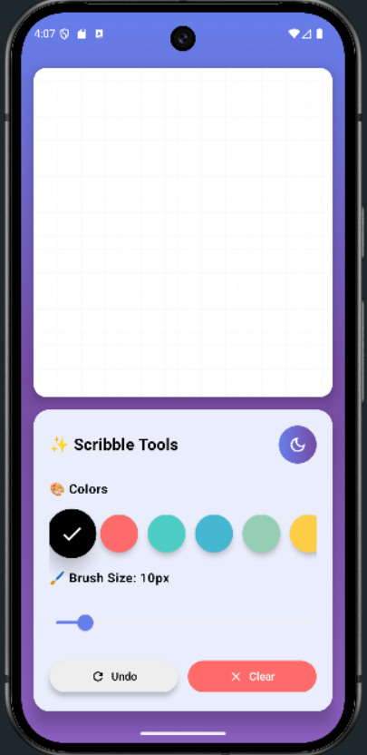
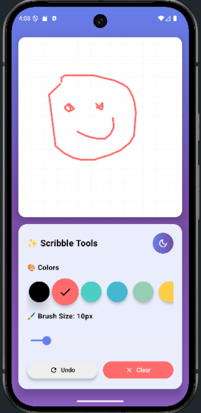
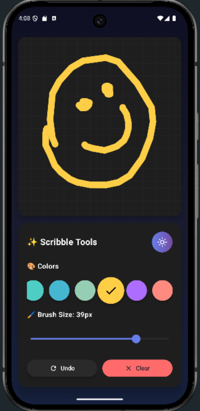

 ## Scribble App

 A simple and fun drawing application where users can freely draw on the screen using touch input. Built with Android and Jetpack libraries.

 ### Features
  -  Draw freely using your finger

- Choose different colors

-  Change brush size

-  Save your drawing to gallery //WORKING ON THIS 

-  Clear canvas with a tap 

-  Share your creation with friends

## build.gradle.kts(Project level)

      // In your project-level build.gradle.kts
    plugins {
    id("com.android.application") version "8.9.2" apply false
    id("org.jetbrains.kotlin.android") version "1.9.20" apply false
    id("org.jetbrains.kotlin.plugin.compose") version "2.0.21" apply false
}

## dependencies 

  // Compose BOM
    implementation(platform("androidx.compose:compose-bom:2024.05.00"))

    // Core Compose Libraries
    implementation("androidx.compose.ui:ui")
    implementation("androidx.compose.material3:material3")
    implementation("androidx.compose.ui:ui-tooling-preview")
    implementation("androidx.activity:activity-compose:1.8.2")
    implementation("androidx.core:core-ktx:1.12.0")

    // Material Icons Extended (for Outlined and other icons)
    implementation("androidx.compose.material:material-icons-extended")

    // Compose Animations
    implementation("androidx.compose.animation:animation")

    // Lifecycle
    implementation("androidx.lifecycle:lifecycle-runtime-compose:2.6.2")
    implementation("androidx.lifecycle:lifecycle-viewmodel-compose:2.6.2")

## SCREENSHOTS

